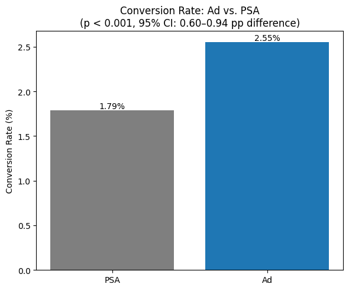
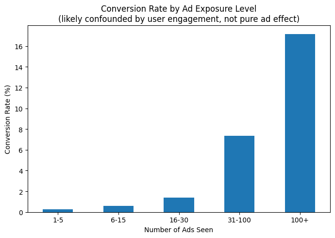

# Marketing A/B Test: Do Ads Actually Drive Conversions?

## Overview
Statistical analysis of a real marketing A/B test with 588,101 users. One group saw ads (treatment), another saw a public service announcement (PSA, a neutral placeholder acting as control). This project tests whether ads produced a statistically significant lift in conversion rate, and examines whether ad exposure frequency also matters.

## Dataset
[Marketing A/B Testing](https://www.kaggle.com/datasets/faviovaz/marketing-ab-testing) (Kaggle) — 588,101 users, no missing values, no duplicates.

## Data Overview
- Ad group: 564,577 users (96%)
- PSA group: 23,524 users (4%)
- This imbalance is a feature of the original experiment, not a data quality issue, but it matters for interpreting significance

## Did Ads Significantly Outperform PSA?
Ran a two-proportion z-test comparing conversion rates between groups.

**Result**: Ads converted at 2.55% vs. 1.79% for PSA (a ~43% relative lift). This difference is highly statistically significant: **p = 1.71×10⁻¹³**, 95% confidence interval on the difference: **[0.60, 0.94] percentage points**. Since the interval never crosses zero, we can be confident ads reliably outperform the PSA, not just in this sample but in the underlying population.

## Does Ad Exposure Frequency Matter?
Checked whether the two groups differed in average ad/PSA exposure (ruling out frequency as a confound), then looked at conversion rate by exposure level within the ad group.

**Finding**: Both groups saw nearly identical average exposure (~24.8 ads each), so the conversion difference above is driven by content type, not frequency.

**Finding**: Conversion rate climbs sharply with exposure, from 0.25% (1-5 ads) to 17.1% (100+ ads). **Important caveat**: this is very likely reverse causation, not a pure ad effect. Users who see 100+ ads are users who kept browsing for a long time, and are plausibly more engaged and more likely to convert regardless of the ads themselves. Engagement level likely drives both variables, this is a correlation, not proof that more ads cause more conversions.

## Tools
Python, pandas, scipy (hypothesis testing), matplotlib, Google Colab

## What I'd Do Next
- Control for user engagement/session length to isolate the true causal effect of ad exposure, rather than relying on raw exposure count
- Segment the significance test by day of week or hour to check whether the ad effect is consistent across all `most ads day` / `most ads hour` values
- Run a cost-benefit analysis: at what exposure level does the marginal conversion gain justify the marginal ad spend?
